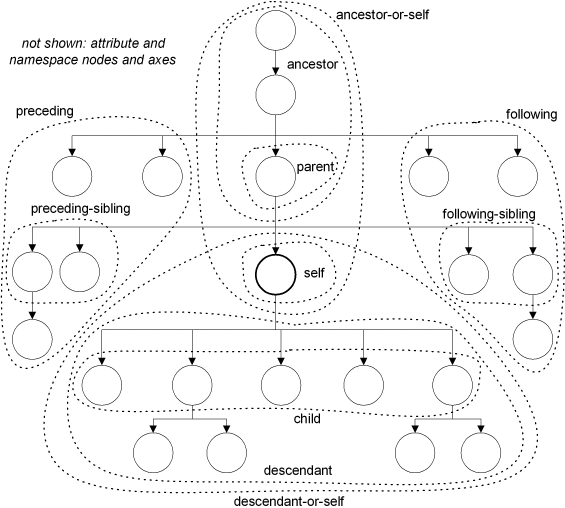

# XPATH - 1

---
## Introduction

XPath est définit par le [W3C](https://www.w3.org/TR/xpath-31/).
Il existe à ce jour trois versions majeures :

- 1.0 (1997)
- 2.0 (2007)
- 3.1 (2017)

La version 1.0 est la plus largement implémentée, mais nous verrons les versions 2.0 et 3.1

XPath s'utilise généralement avec XSLT, Xquery, les bases de données XML ou bien les parsers XML.

---
## Navigation

Un document XML est une structure arborescente.

XPath est un langage de requêtes qui permet de :

- naviguer
- sélectionner des nœuds dans un document XML.

Exemples :

```xml
parent::livre
/TEI/teiHeader
count(//nom)
```
1: sélectionner le parent de l'élément courant (choisi dans Oxygen), qui (le parant) a le nom "livre"
2: à partir de la racine, on descent et choisit teiHeader
3: compter tous les noeuds qui ont le nom "nom"
---
La syntaxe pour exprimer une requête est

```xml
nom-axe::predicat[condition-sur-predicat]
```

L'axe est ce qui entraîne la navigation, c'est à dire dans quel sens (vertical/horizontal) on va se déplacer dans notre document. Il présélectionne un des nœuds.

Le prédicat est la condition de sélection.

Exemple :

```xml
child::livre/child::auteur      (ou bien en abréger, livre/auteur)
self::auteur/nom                (ou bien en abréger ./nom)
parent::livre                   (ou bien en abréger ..)
```
Attention : `//` n'est pas un moyen efficace (gourmant sur le mémoire), il va parcourir tout le fichier; si on a un très gros fichier et on connait la structure du fichier, il vaut mieux partir de la racine
---
### Les différents axes

Il existe 13 axes pour se déplacer dans le document. Ils sont répartis en deux catégories : les axes verticaux et les axes horizontaux.

Le nœud courant (du contexte) désigne le nœud sur lequel on est actuellement. Son évaluation varie selon le déplacement effectué.
Voir [https://stackoverflow.com/questions/1022345/current-node-vs-context-node-in-xslt-xpath/52151497#52151497](https://stackoverflow.com/questions/1022345/current-node-vs-context-node-in-xslt-xpath/52151497#52151497)
Si on utilise chemin absolu (à partir de la racine), c'est pas important ou se trouve le curseur; sinon, il faut faire attention à l'élément choisi.
---
#### Axes verticaux

| Nom | Description |
| --- | --- |
| `child` | les nœuds fils du nœud courant |
| `parent` | le nœud parent du nœud courant (sauf la racine) |
| `self` | le nœud courant (utile pour exprimer une condition sur soi) |
| `attribute` | les attributs du nœud courant |
| `descendant` | les nœuds fils du nœud courant ainsi que leurs descendants. |
| `descendant-or-self` | comme pour descendant, mais on se sélectionne également |
| `ancestor` | les nœuds parents du nœud courant ainsi que leurs ancêtres. |
| `ancestor-or-self` | comme pour ancestor, mais on se sélectionne également |

La différence entre `child/parent` et `descendant/ancestor` est que dans le cas de child et parent, on s'arrête au niveau précédant/suivant.
Alors que `descendant` et `ancestor` sont récursifs, c'est-à-dire qu'ils vont remonter ou descendre jusqu'au début/fin du document XML.

---
#### Axes horizontaux

| Nom | Description |
| --- | --- |
| `preceding-sibling` | les nœuds frères du nœud courant qui viennent avant lui ("en haut") |
| `following-sibling` | les nœuds frères du nœud courant qui viennent après lui ("en bas") |
| `preceding` | tous les nœuds précédant le nœud courant |
| `following` | tous les nœuds suivant le nœud courant |
| `namespace` | les nœuds qui sont des espaces de nom |

---
#### Voir le schéma

Source : [https://nwalsh.com/docs/tutorials/xsl/xsl/foil22.html](https://nwalsh.com/docs/tutorials/xsl/xsl/foil22.html)



Voir le fichier `axes.xml` dans xml pour tester les requêtes de ce document

---
### Les prédicats

Le prédicat permet d'exprimer des conditions sur l'axe.

`child::livre` : les nœuds enfants appelés `<livre>`

On peut également appliquer une condition sur le prédicat (if ...).
La syntaxe est  ̀predicat[condition]`.

`child::livre[text() = 'Documents Structurés']` : les nœuds enfants appelés `<livre>` qui ont pour valeur textuelle 'Documents Structurés'.

Un prédicat peut lui-même être une expression XPath.

`child::livre[child::page[not(child::footnoot)]]` : les nœuds enfants `<livre>` qui ont des `<page>` ne contenant pas de `<footnote>`
`child::livre[2]` : le second nœud enfant `<livre>`

Lorsque l'on utile les crochets `[]`, on ne se déplace pas sur l'axe. Le déplacement est induit par le slash `/`.
Les deux exemples suivants n'expriment pas la même chose. Le premier cas, on se déplace sur `<livre>` puis `<page>`. Le second cas, sélectionne les `<livre>` qui ont `<page>` pour enfant.

```xml
child::livre/child::page
child::livre[child::page]
```
exemple: on est sur `<titleStmt>`
```xml
<titleStmt>
	<title>a</title>
	<title>
		<name>b</name>
	</title>
</titleStmt>
```
```xml
child::title/name             (on va se déplacer jusqu'à name)
child::title[child::name]     (on va sélectionner title, avec name compris)
child::title/child::name[@n]   (on veut se déplacer à l'élément name qui a un attribut n)
```
---
Il existe des notations abrégées pour simplifier la syntaxe.

| Abréviations | Formes | Explication |
|--------|---------|---------|
| `*` | | n'importe quel nœud(sans connaître son nom) |
| `.` | `self::*` | le nœud courant |
| `..` | `parent::*` | le nœud parent |
| `./*` | `child::*` | les nœuds enfants |
| `.//*` | `descendant::*` | tous les nœuds descendant du nœud courant |
| `@id` | `attribute::id` | l'attribut id du nœud courant |
| `/` | `ancestor-or-self::*[position() = last()]` | la racine du document |
| `//*` | /descendant-or-self | tous les nœuds de l'arbre |

Il est possible de mélanger les notations abrégrées avec les notations complètes.

---
## Exercice

[https://developer.mozilla.org/en-US/docs/Web/XPath/Functions](https://developer.mozilla.org/en-US/docs/Web/XPath/Functions)

### Partie 1

À partir du fichier `juicers.xml`

1. Sélectionner la racine du document  
`/juicers`  
2. Tous les noeuds `juicer`  
`/juicers/juicer`  
3. Tous les noeuds `juicer` avec le contexte sur `<juicer>`  
`//juicer`  
4. Tous les noeuds `juicer` avec le chemin absolu  
5. Tous les noeuds attributs de `juicer`  
`./juicer/@*`  
6. Le texte des noeuds attributs de `juicer`  
`/juicers/juicer/@*/data()`  
7. Tous les enfants de `juicer`  
`/juicers/juicer/*` ou `/juicers/juicer/child::*`  
8. Tous les `juicer` qui ont un attribut `type="gear"`  
`//juicer[@type = "gear"]`  
9. Le premier `juicer`  
`/juicers/juicer[1]`  
10. Le dernier `juicer`  
`/juicers/juicer[last()]`  
11. La garantie pour le 4ième `juicer`  
`/juicers/juicer[4]/warranty`  
12. Les `juicer` avec un `cost` inférieur à `100`$  
`/juicers/juicer[cost < 100]`  
13. Les `juicer` qui n'ont pas d'image.  
`//juicer[not(image)]`  
14. À partir de la racine, afficher le dernier `juicer`  
`/juicers/juicer[last()]`  
15. À partir de la description du second `juicer`, afficher le dernier noeud ancêtre  
`ancestor::*[last()]`  
16. Compter le total de noeuds du document  
`count(//*)`  
**17. Afficher les noeuds avec 2 enfants et + **  
`//*[count(child::*) >= 2]` ou `//*[child::*[position() >= 2]]`  
18. Afficher tous les noeuds qui sont en seconde position  
`//*[2]`  
19. Trouver le nom de l'elément suivant l'élément `name`  
`//name/following-sibling::*[position()=1]/name()`  
20. Afficher les noeuds textes avec plus de 140 caractères  
`//text()[string-length(.) > 140]`  
21. Afficher tous les noeuds `juicer` avec une url en `.html`  
`//juicer/retailer[contains(text(), 'html')]`  


### Partie 2

À partir du fichier `PDV.xml`  
(2e correction est la version du prof)

1. L'élément racine du document  
`/`  
2. Tous les noeuds enfants de `<pdv>`  
`/pdv_liste/pdv/child::*`  
`/pdv_liste/pdv/child::node()`  
3. Les noeuds textes de toutes les villes  
`/pdv_liste/pdv/ville/text()`  
4. Le 46ième point de vente  
`/pdv_liste/pdv[46]`  
5. Le dernier élément `<prix>` de chaque point de vente  
`/pdv_liste/pdv/prix[last()]`  
`/pdv_liste/pdv/prix[position()=last()]`  
6. Le point de vente dont l'ID est 3150005  
`/pdv_liste/pdv[@id = "3150005"]`  
7. Les points de vente qui ne proposent pas de "GPL"   
`/pdv_liste/pdv[child::services [not(child::service[text() = "GPL"])]]`  
`//pdv[services[not(service[text()="GPL"])]]`  
8. Tous les noeuds frères à droite de l'élément `<services>`  
`/pdv_liste/pdv/services/following-sibling::*`  
9. La ou les ville(s) dont le code postal est 16170  
`/pdv_liste/pdv[@cp = "16170"]/ville`  
10. Les points de vente qui ne sont pas ouverts le lundi  
`/pdv_liste/pdv[ouverture/@saufjour = "Lundi"]`  
`/pdv_liste/pdv[ouverture[@saufjour="Lundi"]]`  
11. Les points de vente ouvrant le service "Relais colis"  
`/pdv_liste/pdv[descendant::service/text() = "Relais colis"]`  
`//service[text()="Relais colis"]/../parent::*`  
12. Le ou les éléments dont le 10ième élément venant à droite a pour valeur textuelle "Piste poids lourds"  
`//*[following::*[10]/text() = "Piste poids lourds"]`  
`//*[following::*[10] ="Piste poids lourds"]`  
13. La ou les ville(s) dont le point de vente a été en rupture de "SP95" le 04 février 2013  
`//pdv[rupture[@nom = "SP95" and contains(@début,"2013-02-04")]]`  
`//rupture[@nom="SP95" and matches(@début, '2013-02-04')]/..`  
14. Tous les points de vente qui n'ont pas connu de fermeture  
`//pdv[fermeture[not(node())]]`  
`/pdv_liste/pdv/fermeture[not(@*)]/..`  
15. Est-ce que la ville de La Mure propose du carburant E10 ? Écrire la requête.  
`/pdv_liste/pdv[ville = "La Mure" and prix/@nom = "E10"]`  
`/pdv_liste/pdv/ville[text()="La Mure"]/../prix[@nom="E10"]`  
16. Combien existe t-il de points de vente ? 10824  
`/pdv_liste/count(pdv)`  
`count(//pdv)`  
17. Écrire une expression pour compter la longueur de la chaîne de caractères des éléments `<adresse>`  
`//adresse/string-length(text())`  
`//adresse/string-length()`  
18. Reprendre cette expression et trouver la valeur maximale  75  
`max(//adresse/string-length(text()))`  
`max(//adresse/string-length())`  
19. Selectionner les points de vente qui ne ferment pas à `20:00`  
`/pdv_liste/pdv[ouverture/@fin != "20:00"]`  
`//pdv[ouverture[@fin!="20:00"]]`  
20. Afficher le nom des différents carburants proposés en minuscule  
`distinct-values(//pdv/prix/lower-case(@nom))`  
`//prix/lower-case(@nom)`  
21. Remplacer le point contenu dans l'attribut `latitude` par `--` (Attention, il faudra échapper le point)  
`//pdv/translate(@latitude,".","--")`  
`//pdv/replace(@latitude,"\.", "--")`  
22. Inverser la date et l'heure dans les attributs `maj`, et changer le séparateur par `T` (t majuscule)  
`//pdv/prix/string-join((substring-after(@maj ," "),substring-before(@maj , " ")),"T")`  
`/pdv_liste/pdv/prix/string-join(reverse(tokenize(@maj, ' ')), 'T')`  